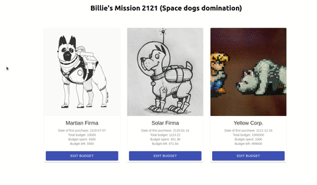
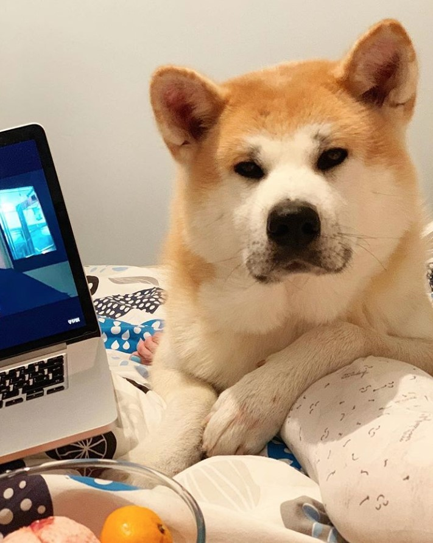

# Billie Challenge

This project hosts the solution for Billie's Frontend Challenge :)

In it I will describe the process of how I decided to solve the problem, the technologies that I used and also the PRs and Testing.

Feel free to use the project as you like and to switch to any PR to see the development of any particular feature, if there is any question feel free to hit me up.

I divided the project into PRs to see each feature being developed independently, think of them as tickets or just to isolate each feature in case we need to revert it.

# Demo

You can find the demo online at:

https://billiechallenge.netlify.app/



## Objective:

Billie's mission 2021. Humans finally met extraterrestrial civilizations. Spaceships are now able to travel to
galaxies far away. Isaac Asimov can finally be proud of us

**Task 1**: Display a list of
companies

**Task 2**: Allow to edit the total budget

## Extra features that were developed outside of coding task:

- ADDED Images resembling the space doggos to the martian projects.
- ADDED Material UI
- ADDED Testing
- ADDED Validation for budget
- ADDED displaying success and error message when updating budget
- CI/CD for website hosted in Netlify

# How did I decide to tackle the problem?

The first thing was to analyze what is being asked so I may divide this into a list of subtasks and work them independently in a seperate PR to isolate them.

After these subtasks have been decided, the next one was to decide the Tech Stack to be used, possible benefits and alternatives to it, after all it all comes the right tool for the right job. In this case I decided using React, Material UI, Jest and Enzyme.

So we got our features with the list of tasks, and our tech stack! We are just missing a good Latte Macchiato with a Espresso and we can get our hands on coding!

# Tech stack

- React
- Jest
- Enzyme
- Material UI

# How to run the program?

```shell
##Execute the following commands:

git clone https://github.com/Rodolfoarv/Billie.git

cd Billie

```

### Install the dependencies

```shell
npm install
```

### Execute the program

```shell
npm start
```

### Execute the tests

```shell
npm run test
```

# Pull Request

Every "small feature" was developed in a separated pull request with the commits associated to it. This is a common practice I follow, afterwards someone reviews my PR or do a Pair Programming exercise to ensure the quality and coding standards of the feature being developed.

You may switch to a PR at anytime in which I divided it in the following:

- Fetching Data (obtaining the data and passing it to the component)
- Modal Feature (creation of the modal to update the budget)
- UI Improvements
- Testing
- Cleaning / Refactoring / Readme

## Who reviewed my PR's ?

My friend's dog was in charge with the mission of reviewing my PRs in exchange for food.



# Big Thank You

It was fun working in this project, I love projects related to spaces and I wanted to add something I like too which are the dogs, so decided adding a Space Doggo theme.
